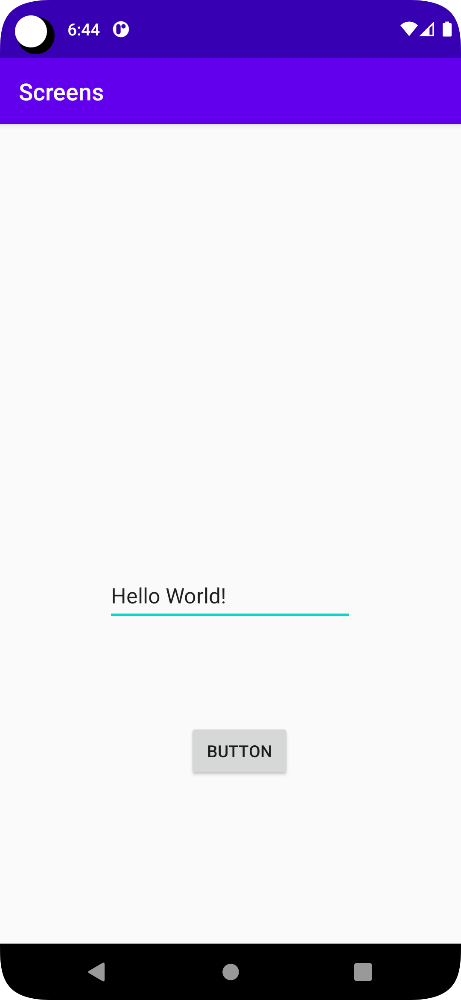
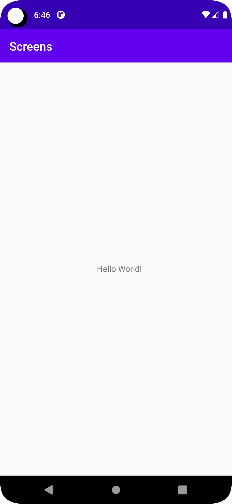

# Rapport

För denna uppgift var uppdraget att starta en annan activity och överföra data via MainActivity. Först
skapades en ny activity som skulle startas via en knapp på MainActivity. Därefter läggs ett textfält till MainActivity,
när knappen trycks skickas värdet som skrivs i textfältet till SecondActivity där det visas med hjälp av en textview.

Kod för knappen och textfält i MainActivity
```
<Button
        android:id="@+id/button"
        android:layout_width="wrap_content"
        android:layout_height="wrap_content"
        android:layout_marginStart="160dp"
        android:layout_marginLeft="160dp"
        android:layout_marginBottom="140dp"
        android:text="Button"
        app:layout_constraintBottom_toBottomOf="parent"
        app:layout_constraintStart_toStartOf="parent" />

    <EditText
        android:id="@+id/editText"
        android:layout_width="wrap_content"
        android:layout_height="wrap_content"
        android:layout_marginBottom="84dp"
        android:ems="10"
        android:hint="Text"
        android:inputType="textPersonName"
        android:minHeight="48dp"
        app:layout_constraintBottom_toTopOf="@+id/button"
        app:layout_constraintEnd_toEndOf="parent"
        app:layout_constraintHorizontal_bias="0.497"
        app:layout_constraintStart_toStartOf="parent" />
```

Kod för onclick på knappen som tar text värdet och startar SecondActivity
```
send.setOnClickListener(view -> {
    Intent intent = new Intent(MainActivity.this, SecondActivity.class);
    intent.putExtra("Text", text.getText().toString());

    startActivity(intent);
});
```

TextView i SecondActivity som visar text som skickas
```
<TextView
        android:id="@+id/textView"
        android:layout_width="wrap_content"
        android:layout_height="wrap_content"
        android:layout_marginStart="164dp"
        android:layout_marginLeft="164dp"
        android:layout_marginBottom="340dp"
        android:text="TextView"
        app:layout_constraintBottom_toBottomOf="parent"
        app:layout_constraintStart_toStartOf="parent" />

```

Kod för att hämta texten som skickas via intent och sätter in text värdet i TextView
```
Intent intent = getIntent();
Bundle extras = intent.getExtras();
String text = extras.getString("Text");

TextView.setText(text);
```


